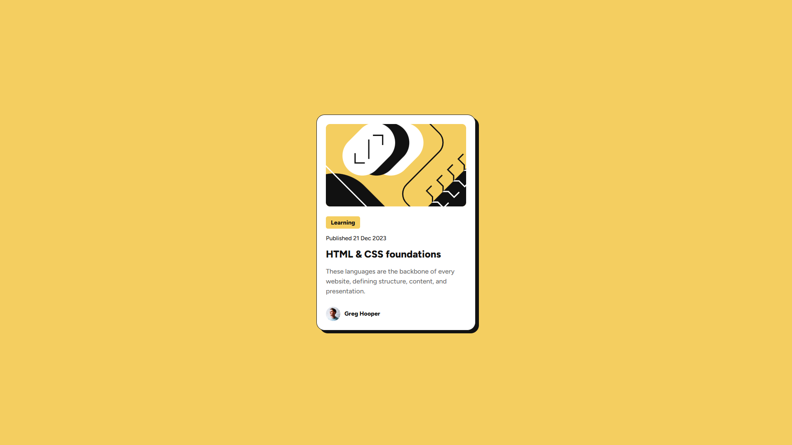

# Frontend Mentor - Blog preview card solution

This is a solution to the [Blog preview card challenge on Frontend Mentor](https://www.frontendmentor.io/challenges/blog-preview-card-ckPaj01IcS).

## Table of contents

- [Overview](#overview)
  - [Screenshot](#screenshot)
  - [Links](#links)
- [My process](#my-process)
  - [Built with](#built-with)
  - [Continued development](#continued-development)
  - [Useful resources](#useful-resources)
- [Author](#author)
- [Acknowledgments](#acknowledgments)

## Overview

### Screenshot

### Links

- Solution URL: [GitHub](https://github.com/g-akca/blog-preview-card)
- Live Site URL: [Blog Preview Card](https://g-akca.github.io/blog-preview-card/)

## My process

### Built with

- Semantic HTML5 markup
- CSS custom properties
- Flexbox
- Media queries

### Continued development

I want to work on font units and responsive design more.

### Useful resources

- [object-fit - CSS | MDN](https://developer.mozilla.org/en-US/docs/Web/CSS/object-fit) - Helped me resize the image and always fill the container without changing the image's aspect ratio (cover).
- [box-shadow - CSS | MDN](https://developer.mozilla.org/en-US/docs/Web/CSS/box-shadow) - I keep forgetting which values of box-shadow set which effect, so this page was helpful.

## Author

- GitHub - [@g-akca](https://github.com/g-akca)
- Frontend Mentor - [@g-akca](https://www.frontendmentor.io/profile/g-akca)

## Acknowledgments

I would like to thank Frontend Mentor for providing this wonderful project to Frontend development beginners for free.
